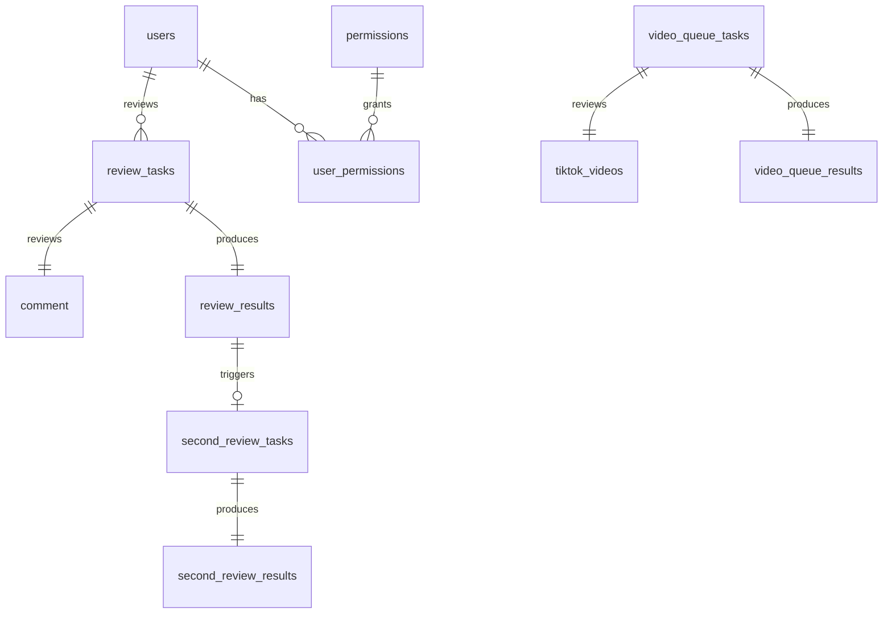

# AI 协作开发数据库管理指南

> 如何在数据库表不断增长的情况下，有效地与 AI 协作进行开发

---

## 📊 当前项目数据库状态

### 数据库概览

**项目**: Comment Review Platform
**数据库**: Supabase PostgreSQL (项目 ID: bteujincywcdclrkosdc)
**区域**: ap-southeast-1
**PostgreSQL 版本**: 15.8.1

### 当前表数量统计

您的项目目前已有 **25 个数据库表**，分布如下：

| 功能模块 | 表数量 | 主要表 |
|---------|--------|--------|
| 用户与权限 | 3 | `users`, `permissions`, `user_permissions` |
| 评论审核 | 6 | `review_tasks`, `review_results`, `second_review_tasks`, `quality_check_tasks` |
| 视频审核 | 8 | `tiktok_videos`, `video_first_review_tasks`, `video_queue_tasks`, `video_queue_results` |
| 通知系统 | 2 | `notifications`, `user_notifications` |
| 标签配置 | 2 | `tag_config`, `video_quality_tags` |
| 队列管理 | 2 | `task_queue`, `task_queues` |
| 审核规则 | 1 | `moderation_rules` |
| 邮箱验证 | 1 | `email_verification_logs` |

**Migration 文件数量**: 6 个
**总数据行数**: 约 10,000+ 行

---

## 🤔 核心问题：单数据库 vs 多数据库

### 1. 单数据库方案（推荐 ✅）

**适用场景**：
- **中小型项目** (表数量 < 100)
- **业务模块紧密耦合** (如审核系统中的评论和视频)
- **团队规模较小** (< 20 人)
- **数据需要跨模块关联查询**

**优势**：
1. **简化开发**: 单一数据源，无需处理跨库事务
2. **降低成本**: 只需维护一个数据库实例
3. **方便查询**: 可以轻松进行 JOIN 跨表查询
4. **统一管理**: 一套备份、监控、迁移策略
5. **AI 友好**: AI 可以一次性获取完整的 schema，理解全局结构

**劣势**：
1. **性能瓶颈**: 当数据量达到亿级时可能出现性能问题
2. **扩展限制**: 难以针对不同模块进行独立优化
3. **复杂度增长**: 表越多，schema 越复杂，理解成本增加

**推荐理由**：
- 您当前的 25 个表仍在可控范围内
- 业务模块间存在大量关联（评论审核、视频审核、用户权限）
- Supabase 支持高达 **500 个表** 和 **TB 级数据**
- 使用 schema 隔离可以在单库中实现逻辑分离

---

### 2. 多数据库方案（谨慎使用 ⚠️）

**适用场景**：
- **微服务架构** (每个服务独立数据库)
- **不同业务域完全独立** (如电商系统中的订单库、用户库、商品库)
- **需要不同数据库技术** (如 PostgreSQL + MongoDB + Redis)
- **团队按业务域分工明确**

**优势**：
1. **独立扩展**: 每个数据库可以独立优化和扩容
2. **故障隔离**: 一个数据库挂掉不影响其他服务
3. **技术多样性**: 可以为不同场景选择最优数据库
4. **团队自治**: 各团队可以独立管理自己的数据库

**劣势**：
1. **开发复杂度**: 需要处理分布式事务、数据一致性
2. **成本增加**: 每个数据库都有基础成本（Supabase 每个项目 $25/月起）
3. **跨库查询困难**: 无法直接 JOIN，需要在应用层聚合
4. **AI 理解困难**: AI 需要分别加载多个数据库 schema，上下文分散

**何时拆分**：
- 表数量 > 100 且业务模块完全独立
- 单表数据量 > 1 亿行且性能成为瓶颈
- 采用微服务架构，服务间通过 API 通信
- 需要不同的数据库技术栈

---

## 💡 推荐架构：单数据库 + Schema 隔离

### 最佳实践：使用 PostgreSQL Schema

在单个 Supabase 数据库中，通过 **schema** 实现逻辑分离：

```
comment-review-platform (单个数据库)
├── public (默认 schema)
│   ├── users
│   ├── permissions
│   └── user_permissions
├── comment_review (评论审核模块)
│   ├── review_tasks
│   ├── review_results
│   ├── second_review_tasks
│   └── quality_check_tasks
├── video_review (视频审核模块)
│   ├── tiktok_videos
│   ├── video_queue_tasks
│   ├── video_queue_results
│   └── video_quality_tags
├── notification (通知模块)
│   ├── notifications
│   └── user_notifications
└── config (配置模块)
    ├── tag_config
    ├── moderation_rules
    └── task_queues
```

### 实施步骤

#### 1. 创建 Schema Migration

```sql
-- migrations/007_create_schemas.sql

-- 创建各业务模块的 schema
CREATE SCHEMA IF NOT EXISTS comment_review;
CREATE SCHEMA IF NOT EXISTS video_review;
CREATE SCHEMA IF NOT EXISTS notification;
CREATE SCHEMA IF NOT EXISTS config;

-- 授权
GRANT USAGE ON SCHEMA comment_review TO authenticated;
GRANT USAGE ON SCHEMA video_review TO authenticated;
GRANT USAGE ON SCHEMA notification TO authenticated;
GRANT USAGE ON SCHEMA config TO authenticated;
```

#### 2. 迁移现有表（可选）

```sql
-- migrations/008_migrate_to_schemas.sql

-- 移动评论审核相关表
ALTER TABLE review_tasks SET SCHEMA comment_review;
ALTER TABLE review_results SET SCHEMA comment_review;
ALTER TABLE second_review_tasks SET SCHEMA comment_review;
ALTER TABLE quality_check_tasks SET SCHEMA comment_review;

-- 移动视频审核相关表
ALTER TABLE tiktok_videos SET SCHEMA video_review;
ALTER TABLE video_queue_tasks SET SCHEMA video_review;
ALTER TABLE video_queue_results SET SCHEMA video_review;

-- 移动通知相关表
ALTER TABLE notifications SET SCHEMA notification;
ALTER TABLE user_notifications SET SCHEMA notification;
```

#### 3. 在应用代码中引用

```go
// 使用完整表名引用
db.Query("SELECT * FROM comment_review.review_tasks")
db.Query("SELECT * FROM video_review.video_queue_tasks")
```

### 优势总结

✅ **保持单数据库的所有优势**
✅ **逻辑清晰，便于 AI 理解**（AI 可以按 schema 分组理解表）
✅ **支持跨 schema JOIN**
✅ **权限控制更细粒度**
✅ **未来可以轻松拆分成独立数据库**（如果真的需要）

---

## 🤖 与 AI 协作开发的最佳实践

### 1. 为 AI 提供完整上下文

#### ❌ 不好的做法

```
用户: "帮我新增一个任务优先级功能"
```

AI 需要猜测：
- 是哪个任务系统？（评论任务？视频任务？）
- 需要修改哪些表？
- 优先级如何影响现有流程？

#### ✅ 好的做法

```
用户: "我需要为视频审核队列 (video_queue_tasks) 新增一个优先级功能。

需求：
1. 在 video_queue_tasks 表新增 priority 字段 (INTEGER, 默认 50)
2. 优先级范围 1-100，数字越大越优先
3. 领取任务时优先分配高优先级任务
4. 在管理后台可以修改任务优先级

相关表：
- video_queue_tasks (主表)
- 需要修改的 API: /api/video-queue/claim

技术栈：
- 后端: Go + Gin
- 前端: Vue 3 + TypeScript
- 数据库: Supabase PostgreSQL
"
```

### 2. 利用 Supabase MCP 工具

您已经配置了 Supabase MCP，AI 可以直接：

```bash
# AI 可以自动执行这些操作

1. 查看项目列表
   mcp__supabase__list_projects

2. 查看所有表结构
   mcp__supabase__list_tables (project_id: bteujincywcdclrkosdc)

3. 查看 migrations
   mcp__supabase__list_migrations

4. 应用新 migration
   mcp__supabase__apply_migration (name, query)

5. 执行查询验证
   mcp__supabase__execute_sql

6. 检查安全建议
   mcp__supabase__get_advisors (type: security/performance)
```

#### 示例：AI 自动探索数据库

当你说：
```
"分析一下当前数据库中视频审核相关的表结构"
```

AI 会自动：
1. 调用 `list_tables` 获取所有表
2. 筛选出视频相关表（video_*）
3. 分析表之间的外键关系
4. 提供结构图和优化建议

### 3. 建立数据库文档

在项目根目录创建 `DATABASE_SCHEMA.md`：

```markdown
# 数据库 Schema 文档

## 核心概念

### 用户系统
- users: 用户表
- permissions: 权限定义表
- user_permissions: 用户权限关联表

### 评论审核流程
1. review_tasks (一审)
2. second_review_tasks (二审)
3. quality_check_tasks (质检)

### 视频审核流程（流量池模式）
1. video_queue_tasks (任务表)
   - pool: 100k / 1m / 10m
2. video_queue_results (结果表)
   - review_decision: push_next_pool / natural_pool / remove_violation

## 表关系图

[用 Mermaid 或 ASCII 图展示]

## 命名规范

- 任务表: {module}_tasks
- 结果表: {module}_results
- 配置表: {module}_config
```

每次新增功能时，要求 AI 同步更新此文档。

### 4. Migration 命名规范

```bash
migrations/
├── 001_init_tables.sql              # 初始化
├── 002_notifications.sql             # 通知系统
├── 003_video_review_system.sql       # 视频审核
├── 004_add_email_verification.sql    # 邮箱验证
├── 005_unified_queue_stats.sql       # 统一队列统计
├── 006_video_queue_pool_system.sql   # 视频流量池
└── 007_add_video_priority.sql        # ⬅️ 新增功能用递增编号 + 描述性名称
```

**规范**：
- `{编号}_{功能描述}.sql`
- 编号为 3 位数，从 001 开始
- 描述使用下划线分隔的小写单词
- 一个 migration 专注一个功能

### 5. 提供示例数据

告诉 AI 当前的数据分布：

```sql
-- 示例：告诉 AI 当前数据量
SELECT
    'users' as table_name, COUNT(*) as rows FROM users
UNION ALL
SELECT 'review_tasks', COUNT(*) FROM review_tasks
UNION ALL
SELECT 'video_queue_tasks', COUNT(*) FROM video_queue_tasks;

-- 结果：
-- users: 4
-- review_tasks: 5323
-- video_queue_tasks: 58
```

这帮助 AI 理解：
- 哪些表是核心表（数据量大）
- 性能优化的重点
- 是否需要索引

---

## 📋 AI 协作开发工作流

### 新增功能完整流程

#### 阶段 1：需求分析

**用户输入**：
```
我需要新增一个"任务标注历史记录"功能，记录每个任务被修改的完整历史。
```

**AI 的响应**：
```
我会帮你设计这个功能。让我先了解一下相关的表结构...

[AI 自动调用 mcp__supabase__list_tables]

我看到你有以下任务相关的表：
1. review_tasks (评论一审)
2. second_review_tasks (评论二审)
3. video_queue_tasks (视频审核)

请问：
1. 这个历史记录是针对所有任务类型，还是特定类型？
2. 需要记录哪些变更？（状态、审核员、结果等）
3. 历史记录需要保留多久？
4. 是否需要在前端展示历史记录？
```

#### 阶段 2：方案设计

**AI 提供方案**：
```markdown
## 设计方案

### 1. 数据库设计

创建统一的任务历史表：

CREATE TABLE task_audit_log (
    id SERIAL PRIMARY KEY,
    task_type VARCHAR(50) NOT NULL,  -- 'review_task', 'second_review_task', 'video_queue_task'
    task_id INTEGER NOT NULL,
    action VARCHAR(20) NOT NULL,     -- 'created', 'claimed', 'completed', 'returned'
    old_value JSONB,
    new_value JSONB,
    changed_by INTEGER REFERENCES users(id),
    changed_at TIMESTAMP DEFAULT NOW()
);

CREATE INDEX idx_task_audit_log_task ON task_audit_log(task_type, task_id);
CREATE INDEX idx_task_audit_log_time ON task_audit_log(changed_at);

### 2. 触发器（自动记录）

CREATE OR REPLACE FUNCTION log_task_change()
RETURNS TRIGGER AS $$
BEGIN
    INSERT INTO task_audit_log (task_type, task_id, action, old_value, new_value, changed_by)
    VALUES (
        TG_TABLE_NAME,
        NEW.id,
        TG_OP,
        row_to_json(OLD),
        row_to_json(NEW),
        NEW.reviewer_id
    );
    RETURN NEW;
END;
$$ LANGUAGE plpgsql;

### 3. 应用到所有任务表

CREATE TRIGGER review_tasks_audit
AFTER UPDATE ON review_tasks
FOR EACH ROW EXECUTE FUNCTION log_task_change();

-- 对其他任务表重复...

### 4. API 设计

GET /api/tasks/:id/history
- 返回任务的完整变更历史
- 支持分页和时间范围筛选

### 5. 前端展示

在任务详情页新增"变更历史"tab，以时间线形式展示。
```

#### 阶段 3：实施与验证

**Migration 文件**：
```sql
-- migrations/007_task_audit_log.sql

-- [AI 生成的完整 SQL]
```

**后端代码**：
```go
// internal/handlers/task_history.go

// [AI 生成的 Go 代码]
```

**前端代码**：
```typescript
// frontend/src/views/TaskHistory.vue

// [AI 生成的 Vue 组件]
```

**验证步骤**：
```bash
1. 应用 migration
   AI 调用: mcp__supabase__apply_migration

2. 检查安全性
   AI 调用: mcp__supabase__get_advisors (type: security)

3. 执行测试查询
   AI 调用: mcp__supabase__execute_sql

4. 更新文档
   AI 更新: DATABASE_SCHEMA.md
```

---

## 🎯 如何指导 AI 理解复杂数据库

### 1. 提供业务上下文

**关键信息**：
- **表的作用**：这个表在业务流程中的位置
- **数据流向**：数据如何在表之间流动
- **核心字段**：哪些字段是关键业务逻辑

**示例**：
```markdown
# 视频审核流量池系统说明

## 业务流程
1. 新视频上传后，自动进入 100k 流量池 (video_queue_tasks.pool = '100k')
2. 审核员审核后，根据决策 (review_decision):
   - push_next_pool: 推送到下一流量池 (100k → 1m → 10m)
   - natural_pool: 保持当前流量池，自然分发
   - remove_violation: 违规下架

## 关键表
- video_queue_tasks: 任务表，存储视频和流量池的关联
- video_queue_results: 结果表，存储审核决策

## 核心字段
- pool: 流量池标识 (100k/1m/10m)
- review_decision: 审核决策（决定视频的命运）
- tags: 审核标签（最多 3 个）
```

### 2. 使用 ER 图

在 `DATABASE_SCHEMA.md` 中添加 Mermaid ER 图：



AI 看到这个图后，能立即理解表之间的关系。

### 3. 标注历史遗留问题

如果有技术债务，明确告诉 AI：

```markdown
## 已知问题

### 1. task_queue vs task_queues 重复
- task_queue: 新的队列表，支持 queue_name
- task_queues: 旧的队列表，待迁移
- TODO: 在 v2.0 统一为 task_queue

### 2. 视频审核的两套系统
- 旧系统: video_first_review_tasks + video_second_review_tasks (二审制)
- 新系统: video_queue_tasks (流量池制)
- 状态: 新系统已上线，旧表保留用于数据迁移

当 AI 新增功能时，应使用新系统表。
```

### 4. 提供测试数据脚本

```sql
-- test_data/seed_sample_data.sql

-- 插入测试用户
INSERT INTO users (username, password, role, status) VALUES
    ('reviewer1', '$2a$10$...', 'reviewer', 'approved'),
    ('admin1', '$2a$10$...', 'admin', 'approved');

-- 插入测试任务
INSERT INTO video_queue_tasks (video_id, pool, status) VALUES
    (1, '100k', 'pending'),
    (2, '100k', 'in_progress'),
    (3, '1m', 'completed');
```

当 AI 需要测试新功能时，可以参考这些数据。

---

## 🛠️ Supabase MCP 高级用法

### 1. 定期检查数据库健康

要求 AI 定期执行：

```bash
# 每周检查一次
mcp__supabase__get_advisors (project_id, type: "security")
mcp__supabase__get_advisors (project_id, type: "performance")
```

AI 会提醒你：
- 缺少索引的查询
- 缺少 RLS 策略的表
- 性能瓶颈

### 2. 自动生成 TypeScript 类型

每次修改数据库后：

```bash
mcp__supabase__generate_typescript_types (project_id)
```

AI 会自动更新前端的类型定义。

### 3. 查看实时日志

调试问题时：

```bash
mcp__supabase__get_logs (project_id, service: "postgres")
```

AI 可以分析日志并找出问题。

### 4. 创建开发分支

测试重大变更时：

```bash
mcp__supabase__create_branch (project_id, name: "feature-task-history")
```

在分支上测试通过后再合并到主库：

```bash
mcp__supabase__merge_branch (branch_id)
```

---

## 📈 数据库扩展策略

### 何时需要优化？

| 指标 | 当前状态 | 需要优化的阈值 | 优化方案 |
|------|---------|---------------|---------|
| 表数量 | 25 | > 50 | 使用 schema 隔离 |
| 单表行数 | 5,323 (review_tasks) | > 1000 万 | 分区表 |
| 查询延迟 | - | > 500ms | 添加索引、优化查询 |
| 数据库大小 | - | > 100GB | 归档历史数据 |
| 并发连接数 | - | > 100 | 连接池优化 |

### 性能优化路径

```
阶段 1: 索引优化 (当前推荐)
  ├─ 为常用查询添加索引
  ├─ 使用 EXPLAIN ANALYZE 分析慢查询
  └─ 定期 VACUUM ANALYZE

阶段 2: Schema 隔离 (表数量 > 50)
  ├─ 按业务模块创建 schema
  └─ 保持在单个数据库

阶段 3: 分区表 (单表 > 1000 万行)
  ├─ 按时间分区 (created_at)
  └─ 按业务分区 (pool, status)

阶段 4: 读写分离 (QPS > 10000)
  ├─ 配置只读副本
  └─ 读操作分流

阶段 5: 微服务拆分 (最后手段)
  ├─ 拆分成独立数据库
  └─ 服务间通过 API 通信
```

### 当前建议（针对你的项目）

✅ **立即执行**：
1. 为高频查询添加索引
2. 定期运行 `get_advisors` 检查性能
3. 补充 `DATABASE_SCHEMA.md` 文档

⏳ **短期计划**（3-6 个月）：
1. 采用 schema 隔离模式组织表
2. 设置数据归档策略（审核结果保留 1 年）
3. 添加查询监控

❌ **暂不需要**：
1. 拆分成多个数据库
2. 引入其他数据库技术（MongoDB等）
3. 分库分表

---

## 🎓 AI 协作开发检查清单

### 开始新功能前

- [ ] 明确需求和业务流程
- [ ] 告诉 AI 涉及哪些现有表
- [ ] 提供相关的业务规则
- [ ] 说明是否有性能要求

### AI 提供方案后

- [ ] 检查是否符合现有命名规范
- [ ] 检查是否考虑了外键约束
- [ ] 检查是否添加了必要的索引
- [ ] 检查是否有安全漏洞（如 SQL 注入）

### 实施阶段

- [ ] Migration 文件命名规范
- [ ] 在开发分支测试（使用 Supabase Branch）
- [ ] 运行 `get_advisors` 检查
- [ ] 更新 `DATABASE_SCHEMA.md` 文档
- [ ] 添加测试数据

### 上线后

- [ ] 监控查询性能
- [ ] 检查索引使用情况
- [ ] 定期归档历史数据
- [ ] 更新 API 文档

---

## 📚 推荐的项目文档结构

```
comment-review-platform/
├── README.md                          # 项目概览
├── DATABASE_SCHEMA.md                 # 数据库结构文档 ⭐
├── AI_COLLABORATION_DATABASE_GUIDE.md # 本文档 ⭐
├── API_DOCUMENTATION.md               # API 接口文档
├── DEPLOYMENT.md                      # 部署指南
├── migrations/
│   ├── README.md                      # Migration 说明 ⭐
│   ├── 001_init_tables.sql
│   └── ...
└── docs/
    ├── business/
    │   ├── comment_review_flow.md     # 评论审核流程
    │   └── video_pool_system.md       # 视频流量池说明
    ├── technical/
    │   ├── database_optimization.md   # 数据库优化记录
    │   └── performance_tuning.md      # 性能调优记录
    └── ai_prompts/
        ├── add_new_feature_template.md    # 新功能模板
        └── database_migration_template.md # 数据库变更模板
```

### DATABASE_SCHEMA.md 模板

```markdown
# 数据库 Schema 文档

> 最后更新: 2025-11-24

## 快速导航

- [核心概念](#核心概念)
- [表列表](#表列表)
- [ER 图](#er-图)
- [命名规范](#命名规范)
- [变更历史](#变更历史)

## 核心概念

### 审核流程
[描述评论审核和视频审核的完整流程]

### 权限系统
[描述基于资源和操作的权限模型]

## 表列表

### 用户与权限

#### users
- **作用**: 存储用户基本信息
- **关键字段**:
  - `role`: reviewer / admin
  - `status`: pending / approved / rejected
- **索引**:
  - `idx_users_status` on (status)
- **行数**: 4

#### permissions
[类似格式...]

### 评论审核

#### review_tasks
[...]

## ER 图

```mermaid
[ER 图代码]
```

## 命名规范

- 表名: 小写 + 下划线，复数形式
- 主键: `id` (SERIAL)
- 外键: `{表名单数}_id`
- 时间字段: `created_at`, `updated_at`
- 状态字段: `status`

## 变更历史

### 2025-11-24 - 视频流量池系统
- 新增 `video_queue_tasks`
- 新增 `video_queue_results`
- Migration: `006_video_queue_pool_system.sql`

### 2025-11-20 - 统一队列统计
[...]
```

---

## 🤝 与 AI 的沟通技巧

### 1. 分阶段进行

**不要一次性要求所有功能**：
```
❌ "帮我实现任务优先级、任务历史、任务统计、任务导出功能"
```

**逐步迭代**：
```
✅ "先帮我设计任务优先级功能的数据库表结构"
   [AI 提供方案，确认]
✅ "很好，现在请生成 migration 文件"
   [AI 生成，审查]
✅ "现在实现后端 API"
   [逐步进行]
```

### 2. 利用上下文

**引用现有代码**：
```
"参考 review_tasks 表的设计，为视频审核创建类似的二审表"
```

**引用 migration 文件**：
```
"按照 migrations/003_video_review_system.sql 的风格，
创建新的 migration 文件"
```

### 3. 明确约束条件

**技术约束**：
```
"我们使用 Go 的 database/sql 包，不使用 ORM"
"前端使用 TypeScript，需要类型安全"
```

**业务约束**：
```
"任务一旦领取，30 分钟内必须提交，否则自动释放"
"用户只能看到自己的任务，管理员可以看到所有任务"
```

### 4. 要求 AI 解释

**理解设计决策**：
```
"为什么你选择在 video_queue_results 中使用 JSONB 而不是单独的字段？"
"这个索引的作用是什么？在什么查询中会用到？"
```

### 5. 验证 AI 的理解

**让 AI 复述**：
```
"请用你自己的话描述一下视频流量池系统的完整流程"
```

**让 AI 举例**：
```
"如果一个视频在 100k 流量池被标记为 'push_next_pool'，
数据库中会发生什么变化？请写出具体的 SQL 语句"
```

---

## 🎯 总结与建议

### 针对你的项目

**当前状态**：
- ✅ 25 个表，结构合理
- ✅ 已配置 Supabase MCP
- ✅ 有 migration 管理
- ⚠️ 缺少数据库文档
- ⚠️ 表命名有轻微不一致（task_queue vs task_queues）

**立即行动**：
1. **创建 `DATABASE_SCHEMA.md`** - 让 AI 更好理解你的数据库
2. **统一命名规范** - 解决 task_queue/task_queues 等重复表
3. **运行性能检查** - 使用 `get_advisors` 发现潜在问题
4. **补充索引** - 为高频查询添加索引

**短期优化**（1-3 个月）：
1. 采用 schema 隔离模式
2. 清理废弃的表（如旧的视频审核系统）
3. 建立数据归档策略
4. 创建 AI 提示词模板

**长期策略**（6-12 个月）：
1. 当表数量 > 50 时，考虑按 schema 重组
2. 当单表 > 1000 万行时，考虑分区
3. 当需要独立团队维护不同模块时，考虑拆库

**坚持单数据库的理由**：
- ✅ 你的业务模块高度耦合（评论和视频都依赖用户权限）
- ✅ Supabase 单库性能足够（支持 TB 级数据）
- ✅ 成本效益高（一个数据库 vs 多个数据库）
- ✅ AI 协作更简单（一次性理解完整 schema）
- ✅ 未来可以随时拆分（PostgreSQL schema 天然支持）

### 最终建议

**不要拆分数据库**，除非满足以下任一条件：
1. 单表行数 > 5000 万且性能成为瓶颈
2. 采用微服务架构，服务完全独立部署
3. 需要不同的数据库技术（如 MongoDB、Redis 作为主库）
4. 团队规模 > 50 人，需要独立的数据库管理

对于你的项目，**单数据库 + Schema 隔离** 是最优方案。这样既保持了架构的简洁性，又为未来的扩展留有余地，同时最大化了与 AI 协作的效率。

---

## 📞 需要帮助时

**与 AI 协作遇到问题**：
1. 提供完整的错误信息和日志
2. 说明你已经尝试过的方案
3. 附上相关的表结构和 migration 文件
4. 使用 `mcp__supabase__get_logs` 获取数据库日志

**数据库性能问题**：
1. 运行 `mcp__supabase__get_advisors`
2. 提供慢查询的 EXPLAIN ANALYZE 结果
3. 说明查询的业务场景和频率

**架构决策疑问**：
1. 描述当前的业务规模（用户数、数据量、QPS）
2. 说明预期的增长趋势
3. 列出技术团队的规模和技能栈
4. 明确优先级（性能 vs 开发效率 vs 成本）

---

*本文档会随着项目发展持续更新。建议每个月审查一次，确保策略符合实际情况。*

**Happy Coding with AI! 🚀**
