# 数据库 Schema 文档

> 最后更新: 2025-11-24
> 数据库: Supabase PostgreSQL 15.8.1
> 项目 ID: bteujincywcdclrkosdc
> 区域: ap-southeast-1

---

## 📋 快速导航

- [数据库概览](#数据库概览)
- [表结构详解](#表结构详解)
  - [用户与权限](#用户与权限)
  - [评论审核](#评论审核)
  - [视频审核](#视频审核)
  - [通知系统](#通知系统)
  - [配置与规则](#配置与规则)
- [ER 关系图](#er-关系图)
- [索引策略](#索引策略)
- [命名规范](#命名规范)
- [变更历史](#变更历史)

---

## 数据库概览

### 统计信息

| 类别 | 数量 |
|------|------|
| 总表数 | 25 |
| Migration 文件 | 6 |
| 总数据行数 | ~11,000+ |
| 最大单表行数 | 5,323 (review_tasks) |

### 模块分布

```
数据库表组织结构 (25 张表)

├── 用户与权限 (3 表)
│   ├── users                    # 用户表 (4 行)
│   ├── permissions              # 权限定义 (54 行)
│   └── user_permissions         # 用户权限关联 (117 行)
│
├── 评论审核 (6 表)
│   ├── comment                  # 评论内容 (5,323 行)
│   ├── review_tasks             # 一审任务 (5,323 行)
│   ├── review_results           # 一审结果 (36 行)
│   ├── second_review_tasks      # 二审任务 (11 行)
│   ├── second_review_results    # 二审结果 (9 行)
│   └── quality_check_tasks      # 质检任务 (0 行)
│
├── 视频审核 (8 表)
│   ├── tiktok_videos                 # 视频基础信息 (88 行)
│   ├── video_queue_tasks             # 流量池任务 (58 行) ⭐ 新系统
│   ├── video_queue_results           # 流量池结果 (12 行) ⭐ 新系统
│   ├── video_quality_tags            # 视频标签配置 (39 行)
│   ├── video_first_review_tasks      # 一审任务 (88 行) 🔄 旧系统
│   ├── video_first_review_results    # 一审结果 (37 行) 🔄 旧系统
│   ├── video_second_review_tasks     # 二审任务 (0 行) 🔄 旧系统
│   └── video_second_review_results   # 二审结果 (0 行) 🔄 旧系统
│
├── 通知系统 (2 表)
│   ├── notifications            # 通知内容 (5 行)
│   └── user_notifications       # 用户通知关联 (10 行)
│
├── 配置与规则 (4 表)
│   ├── tag_config               # 违规标签配置 (7 行)
│   ├── moderation_rules         # 审核规则库 (29 行)
│   ├── task_queue               # 任务队列配置 (6 行) ⭐ 新
│   └── task_queues              # 任务队列配置 (5 行) 🔄 旧
│
└── 其他 (2 表)
    ├── messages                      # 消息表 (4 行)
    └── email_verification_logs       # 邮箱验证日志 (0 行)
```

---

## 表结构详解

### 用户与权限

#### `users` - 用户表

**作用**: 存储系统用户的基本信息和状态

| 字段 | 类型 | 说明 | 约束 |
|------|------|------|------|
| id | SERIAL | 用户ID | PRIMARY KEY |
| username | VARCHAR(50) | 用户名 | UNIQUE, NOT NULL |
| password | VARCHAR(255) | 密码哈希 | NOT NULL |
| email | VARCHAR | 邮箱地址 | UNIQUE |
| email_verified | BOOLEAN | 邮箱是否验证 | DEFAULT false |
| role | VARCHAR(20) | 角色 | CHECK (reviewer, admin) |
| status | VARCHAR(20) | 状态 | CHECK (pending, approved, rejected) |
| created_at | TIMESTAMP | 创建时间 | DEFAULT NOW() |
| updated_at | TIMESTAMP | 更新时间 | DEFAULT NOW() |

**索引**:
- `idx_users_status` ON (status)

**业务规则**:
- 新注册用户默认 `status = 'pending'`，需管理员审批
- 密码使用 bcrypt 加密，cost = 10
- `role = 'admin'` 的用户自动拥有所有权限

**默认数据**:
```sql
-- 默认管理员账号
username: admin
password: admin123 (哈希后存储)
role: admin
status: approved
```

---

#### `permissions` - 权限定义表

**作用**: 定义系统中所有可用的权限

| 字段 | 类型 | 说明 |
|------|------|------|
| id | SERIAL | 权限ID |
| permission_key | VARCHAR | 权限键（唯一标识） |
| name | VARCHAR | 权限名称 |
| description | TEXT | 权限描述 |
| resource | VARCHAR | 资源类型 |
| action | VARCHAR | 操作类型 |
| category | VARCHAR | 权限分类 |
| is_active | BOOLEAN | 是否启用 |
| created_at | TIMESTAMP | 创建时间 |
| updated_at | TIMESTAMP | 更新时间 |

**权限命名规范**:
```
{resource}.{action}  或  queue.{type}.{pool}.{action}

示例:
- tasks.claim             # 领取任务
- admin.users.manage      # 管理用户
- queue.video.100k.claim  # 领取100k流量池视频任务
```

**权限分类** (category):
- `comment_review` - 评论审核相关
- `video_review` - 视频审核相关
- `admin` - 管理员功能
- `user` - 用户基础功能

---

#### `user_permissions` - 用户权限关联表

**作用**: 将权限分配给用户

| 字段 | 类型 | 说明 |
|------|------|------|
| id | SERIAL | 关联ID |
| user_id | INTEGER | 用户ID |
| permission_key | VARCHAR | 权限键 |
| granted_at | TIMESTAMP | 授予时间 |
| granted_by | INTEGER | 授予人ID |

**外键**:
- `user_id` → `users(id)`
- `permission_key` → `permissions(permission_key)`
- `granted_by` → `users(id)`

---

### 评论审核

#### 审核流程说明

```
评论审核三阶段流程：

1. 一审 (First Review)
   comment → review_tasks → review_results
   ├─ 通过：直接发布
   └─ 不通过：进入二审

2. 二审 (Second Review)
   review_results → second_review_tasks → second_review_results
   ├─ 确认违规：最终不通过
   └─ 判定误判：标记为质检任务

3. 质检 (Quality Check)
   review_results → quality_check_tasks → quality_check_results
   └─ 检查一审准确性，用于培训和绩效评估
```

---

#### `comment` - 评论内容表

| 字段 | 类型 | 说明 |
|------|------|------|
| id | BIGINT | 评论ID (PRIMARY KEY) |
| text | TEXT | 评论文本内容 |

**RLS**: 已启用行级安全

---

#### `review_tasks` - 一审任务表

| 字段 | 类型 | 说明 | 默认值 |
|------|------|------|--------|
| id | SERIAL | 任务ID | PRIMARY KEY |
| comment_id | BIGINT | 评论ID | FK → comment(id) |
| reviewer_id | INTEGER | 审核员ID | FK → users(id) |
| status | VARCHAR(20) | 状态 | 'pending' |
| claimed_at | TIMESTAMP | 领取时间 | NULL |
| completed_at | TIMESTAMP | 完成时间 | NULL |
| created_at | TIMESTAMP | 创建时间 | NOW() |

**状态流转**:
```
pending → in_progress → completed
  ↑           ↓
  └─── 超时自动释放 (30分钟) ────┘
```

**索引**:
- `idx_review_tasks_status` ON (status)
- `idx_review_tasks_reviewer` ON (reviewer_id)
- `idx_review_tasks_claimed_at` ON (claimed_at)

---

#### `review_results` - 一审结果表

| 字段 | 类型 | 说明 |
|------|------|------|
| id | SERIAL | 结果ID |
| task_id | INTEGER | 任务ID (FK → review_tasks) |
| reviewer_id | INTEGER | 审核员ID |
| is_approved | BOOLEAN | 是否通过 |
| tags | TEXT[] | 违规标签（数组） |
| reason | TEXT | 审核原因 |
| quality_checked | BOOLEAN | 是否已质检 (默认 false) |
| created_at | TIMESTAMP | 创建时间 |

**业务规则**:
- `is_approved = false` 的结果会自动生成二审任务
- `tags` 数组中的标签必须在 `tag_config` 中存在
- 随机抽取 5% 的结果进行质检

---

#### `second_review_tasks` - 二审任务表

**触发条件**: 一审判定为不通过时自动创建

| 字段 | 类型 | 说明 |
|------|------|------|
| id | SERIAL | 二审任务ID |
| first_review_result_id | INTEGER | 一审结果ID (FK) |
| comment_id | BIGINT | 评论ID |
| reviewer_id | INTEGER | 二审员ID |
| status | VARCHAR(20) | 状态 |
| claimed_at | TIMESTAMP | 领取时间 |
| completed_at | TIMESTAMP | 完成时间 |
| created_at | TIMESTAMP | 创建时间 |

---

#### `second_review_results` - 二审结果表

| 字段 | 类型 | 说明 |
|------|------|------|
| id | SERIAL | 二审结果ID |
| second_task_id | INTEGER | 二审任务ID (FK) |
| reviewer_id | INTEGER | 二审员ID |
| is_approved | BOOLEAN | 是否通过 |
| tags | TEXT[] | 违规标签 |
| reason | TEXT | 审核原因 |
| created_at | TIMESTAMP | 创建时间 |

**业务规则**:
- 如果二审判定为通过，说明一审误判，标记为质检任务
- 二审结果为最终结果

---

#### `quality_check_tasks` - 质检任务表

**来源**:
1. 随机抽取 5% 的一审结果
2. 一审和二审结果不一致的任务

| 字段 | 类型 | 说明 |
|------|------|------|
| id | SERIAL | 质检任务ID |
| first_review_result_id | INTEGER | 一审结果ID |
| comment_id | BIGINT | 评论ID |
| reviewer_id | INTEGER | 质检员ID |
| status | VARCHAR(20) | 状态 |
| claimed_at | TIMESTAMP | 领取时间 |
| completed_at | TIMESTAMP | 完成时间 |
| created_at | TIMESTAMP | 创建时间 |

---

### 视频审核

#### 系统说明

**⚠️ 重要**: 视频审核有两套系统

1. **旧系统** (video_first_review_* / video_second_review_*)
   - 二审制：一审 → 二审
   - 评分系统：质量维度打分 (1-40 分)
   - 状态: 已废弃，保留数据用于迁移

2. **新系统** (video_queue_*)
   - 流量池制：100k → 1m → 10m
   - 简化决策：3 种选择
   - 状态: 当前使用 ✅

**AI 开发时请使用新系统表！**

---

#### `tiktok_videos` - 视频基础信息表

| 字段 | 类型 | 说明 |
|------|------|------|
| id | SERIAL | 视频ID |
| video_key | VARCHAR | 视频唯一标识 (UNIQUE) |
| filename | VARCHAR | 文件名 |
| file_size | BIGINT | 文件大小（字节） |
| duration | INTEGER | 时长（秒） |
| upload_time | TIMESTAMP | 上传时间 |
| video_url | TEXT | 视频URL |
| url_expires_at | TIMESTAMP | URL过期时间 |
| status | VARCHAR | 状态 |
| created_at | TIMESTAMP | 创建时间 |
| updated_at | TIMESTAMP | 更新时间 |

**状态值**:
- `pending` - 待审核
- `first_review_completed` - 一审完成（旧系统）
- `second_review_completed` - 二审完成（旧系统）

---

#### `video_queue_tasks` - 视频流量池任务表 ⭐

**核心表**: 新的视频审核系统

| 字段 | 类型 | 说明 | 约束 |
|------|------|------|------|
| id | SERIAL | 任务ID | PRIMARY KEY |
| video_id | INTEGER | 视频ID | FK → tiktok_videos(id) |
| pool | VARCHAR(10) | 流量池 | CHECK (100k, 1m, 10m) |
| reviewer_id | INTEGER | 审核员ID | FK → users(id) |
| status | VARCHAR(20) | 状态 | CHECK (pending, in_progress, completed) |
| claimed_at | TIMESTAMP | 领取时间 | |
| completed_at | TIMESTAMP | 完成时间 | |
| created_at | TIMESTAMP | 创建时间 | DEFAULT NOW() |

**唯一约束**: `UNIQUE (video_id, pool)` - 同一视频在同一流量池只能有一个任务

**流量池说明**:
- `100k`: 入口流量池，所有新视频从这里开始
- `1m`: 中等流量池，表现好的视频进入
- `10m`: 高质量流量池，只有优质视频能到达

**索引**:
- `idx_video_queue_tasks_pool` ON (pool)
- `idx_video_queue_tasks_status` ON (status)
- `idx_video_queue_tasks_video` ON (video_id)

---

#### `video_queue_results` - 视频流量池结果表 ⭐

| 字段 | 类型 | 说明 | 约束 |
|------|------|------|------|
| id | SERIAL | 结果ID | PRIMARY KEY |
| task_id | INTEGER | 任务ID | FK → video_queue_tasks(id) |
| reviewer_id | INTEGER | 审核员ID | FK → users(id) |
| review_decision | VARCHAR(20) | 审核决策 | CHECK (3种) |
| reason | TEXT | 审核理由 | NOT NULL |
| tags | TEXT[] | 审核标签 | 最多3个 |
| created_at | TIMESTAMP | 创建时间 | DEFAULT NOW() |

**审核决策** (review_decision):
1. `push_next_pool` - 推送到下一流量池
   - 100k → 1m
   - 1m → 10m
   - 10m → 保持在10m

2. `natural_pool` - 保持当前流量池，自然分发
   - 内容质量达标但不突出

3. `remove_violation` - 违规下架
   - 存在违规内容

**业务流程**:
```sql
-- 示例：视频在100k流量池被审核
INSERT INTO video_queue_results (task_id, reviewer_id, review_decision, reason, tags)
VALUES (1, 2, 'push_next_pool', '内容优质，有传播潜力', ARRAY['内容优质', '有传播潜力']);

-- 自动创建1m流量池任务
INSERT INTO video_queue_tasks (video_id, pool, status)
VALUES (video_id_from_task_1, '1m', 'pending');
```

**索引**:
- `idx_video_queue_results_task` ON (task_id)
- `idx_video_queue_results_decision` ON (review_decision)

---

#### `video_quality_tags` - 视频质量标签配置

| 字段 | 类型 | 说明 |
|------|------|------|
| id | SERIAL | 标签ID |
| name | VARCHAR | 标签名称 (UNIQUE) |
| description | TEXT | 标签描述 |
| category | VARCHAR | 标签分类 |
| scope | VARCHAR(20) | 适用范围 (默认 'video') |
| queue_id | VARCHAR(10) | 流量池ID (100k/1m/10m) |
| is_active | BOOLEAN | 是否启用 |
| created_at | TIMESTAMP | 创建时间 |

**标签分类** (category):
- `content` - 内容质量
- `technical` - 技术质量
- `compliance` - 合规性
- `engagement` - 互动性

**流量池专属标签**:
- `queue_id = '100k'`: 内容优质、有传播潜力、技术质量好...
- `queue_id = '1m'`: 热点话题、专业制作、高互动性...
- `queue_id = '10m'`: 爆款潜质、顶级制作、强传播力...

**索引**:
- `idx_video_quality_tags_scope` ON (scope)
- `idx_video_quality_tags_queue_id` ON (queue_id)

---

### 通知系统

#### `notifications` - 通知内容表

| 字段 | 类型 | 说明 |
|------|------|------|
| id | SERIAL | 通知ID |
| title | VARCHAR | 通知标题 |
| content | TEXT | 通知内容 |
| type | VARCHAR | 通知类型 |
| created_by | INTEGER | 创建人ID |
| created_at | TIMESTAMP | 创建时间 |
| is_global | BOOLEAN | 是否全局通知 (默认 true) |

**通知类型**:
- `info` - 信息
- `warning` - 警告
- `success` - 成功
- `error` - 错误
- `system` - 系统通知
- `announcement` - 公告
- `task_update` - 任务更新

---

#### `user_notifications` - 用户通知关联表

| 字段 | 类型 | 说明 |
|------|------|------|
| id | SERIAL | 关联ID |
| user_id | INTEGER | 用户ID |
| notification_id | INTEGER | 通知ID |
| is_read | BOOLEAN | 是否已读 (默认 false) |
| read_at | TIMESTAMP | 阅读时间 |
| created_at | TIMESTAMP | 创建时间 |

**业务规则**:
- `is_global = true` 的通知会自动为所有用户创建关联记录
- `is_global = false` 需手动指定接收用户

---

### 配置与规则

#### `tag_config` - 违规标签配置表

**作用**: 配置评论审核中使用的违规标签

| 字段 | 类型 | 说明 |
|------|------|------|
| id | SERIAL | 标签ID |
| name | VARCHAR(50) | 标签名称 (UNIQUE) |
| description | TEXT | 标签描述 |
| scope | VARCHAR(20) | 适用范围 (默认 'comment') |
| queue_id | VARCHAR(20) | 队列ID |
| is_simple | BOOLEAN | 是否简化标签 (默认 false) |
| is_active | BOOLEAN | 是否启用 (默认 true) |
| created_at | TIMESTAMP | 创建时间 |

**默认标签**:
- 广告
- 垃圾
- 色情
- 暴力
- 政治敏感
- 人身攻击

**索引**:
- `idx_tag_config_scope` ON (scope)
- `idx_tag_config_queue_id` ON (queue_id)

---

#### `moderation_rules` - 审核规则库

**作用**: 存储详细的内容审核规则，供审核员参考

| 字段 | 类型 | 说明 |
|------|------|------|
| id | BIGINT | 规则ID |
| rule_code | VARCHAR | 规则编码 (UNIQUE, 如 'A-01') |
| category | VARCHAR | 规则分类 |
| subcategory | VARCHAR | 规则子分类 |
| description | TEXT | 规则描述 |
| judgment_criteria | TEXT | 判定标准 |
| risk_level | VARCHAR | 风险等级 |
| action | TEXT | 处理动作 |
| boundary | TEXT | 边界说明 |
| examples | TEXT | 示例 |
| quick_tag | VARCHAR | 快捷标签 |
| created_at | TIMESTAMP | 创建时间 |
| updated_at | TIMESTAMP | 更新时间 |

**风险等级**:
- `L` (Low) - 低风险
- `M` (Medium) - 中风险
- `H` (High) - 高风险
- `C` (Critical) - 严重风险

**规则分类**:
- A - 人身安全与暴力
- B - 仇恨与歧视
- C - 骚扰与霸凌
- D - 未成年人与性相关
- E - 非法与危险活动
- F - 虚假信息与公共危害
- G - 隐私与个人信息
- H - 垃圾信息与平台安全
- I - 知识产权
- J - 社区秩序与质量

---

#### `task_queue` vs `task_queues` ⚠️

**问题**: 存在两张功能重复的表

**`task_queue` (推荐使用 ✅)**:
- 支持 `queue_name` 作为唯一标识
- 有 `created_by` 和 `updated_by` 字段
- 当前使用中

**`task_queues` (待废弃 🔄)**:
- 旧版本的队列表
- 缺少创建人信息
- 计划迁移数据后删除

**TODO**: 统一为 `task_queue`

---

## ER 关系图



---

## 索引策略

### 当前索引

| 表 | 索引名 | 字段 | 类型 | 作用 |
|---|-------|------|------|------|
| users | idx_users_status | status | B-tree | 过滤待审批用户 |
| review_tasks | idx_review_tasks_status | status | B-tree | 查询待领取任务 |
| review_tasks | idx_review_tasks_reviewer | reviewer_id | B-tree | 查询我的任务 |
| review_tasks | idx_review_tasks_claimed_at | claimed_at | B-tree | 超时任务释放 |
| review_results | idx_review_results_reviewer | reviewer_id | B-tree | 审核员绩效统计 |
| review_results | idx_review_results_created_at | created_at | B-tree | 按时间统计 |
| video_queue_tasks | idx_video_queue_tasks_pool | pool | B-tree | 按流量池查询 |
| video_queue_tasks | idx_video_queue_tasks_status | status | B-tree | 查询待领取任务 |
| video_queue_tasks | idx_video_queue_tasks_video | video_id | B-tree | 查询视频的所有任务 |
| tag_config | idx_tag_config_scope | scope | B-tree | 按范围筛选标签 |

### 优化建议

```sql
-- 建议新增的索引

-- 1. 复合索引：按流量池和状态查询待领取任务
CREATE INDEX idx_video_queue_tasks_pool_status
ON video_queue_tasks(pool, status)
WHERE status = 'pending';

-- 2. 复合索引：审核员的进行中任务
CREATE INDEX idx_review_tasks_reviewer_status
ON review_tasks(reviewer_id, status)
WHERE status = 'in_progress';

-- 3. 部分索引：超时任务快速查询
CREATE INDEX idx_review_tasks_timeout
ON review_tasks(claimed_at)
WHERE status = 'in_progress' AND claimed_at < NOW() - INTERVAL '30 minutes';
```

---

## 命名规范

### 表命名

- **格式**: 小写 + 下划线，使用复数形式
- **示例**: `review_tasks`, `user_permissions`
- **例外**: 实体表可用单数，如 `comment` (内容本身)

### 字段命名

| 类型 | 命名规范 | 示例 |
|------|---------|------|
| 主键 | `id` | id SERIAL PRIMARY KEY |
| 外键 | `{表名单数}_id` | user_id, task_id |
| 时间戳 | `{动作}_at` | created_at, claimed_at |
| 布尔值 | `is_{形容词}` | is_approved, is_active |
| 状态 | `status` | status VARCHAR(20) |
| 数组 | 复数形式 | tags TEXT[], permissions TEXT[] |

### 索引命名

```
idx_{表名}_{字段名}[_{字段名}...]

示例:
- idx_users_status
- idx_review_tasks_reviewer_status
```

### Migration 命名

```
{编号}_{功能描述}.sql

示例:
- 001_init_tables.sql
- 002_notifications.sql
- 006_video_queue_pool_system.sql
```

---

## 变更历史

### 2025-11-24 - 创建 Schema 文档
- 创建完整的数据库文档
- 记录当前 25 张表的结构
- 标注旧系统和新系统的区别

### Migration 006 (2025-11) - 视频流量池系统
- ✅ 新增 `video_queue_tasks` (流量池任务表)
- ✅ 新增 `video_queue_results` (流量池结果表)
- ✅ 扩展 `tag_config` 支持 scope 和 queue_id
- ✅ 创建流量池权限（100k/1m/10m）
- ✅ 创建统计视图 `video_queue_pool_stats`

### Migration 005 (2025-11) - 统一队列统计
- ✅ 优化队列统计逻辑
- ✅ 统一 pending_tasks 计算方式

### Migration 004 (2025-11) - 邮箱验证
- ✅ 新增 `email` 和 `email_verified` 字段到 users
- ✅ 创建 `email_verification_logs` 表

### Migration 003 (2025-11) - 视频审核系统
- ✅ 创建 `tiktok_videos` 表
- ✅ 创建视频一审/二审表（旧系统，现已废弃）
- ✅ 创建 `video_quality_tags` 表

### Migration 002 (2025-11) - 通知系统
- ✅ 创建 `notifications` 表
- ✅ 创建 `user_notifications` 表
- ✅ 支持全局通知和定向通知

### Migration 001 (2025-11) - 初始化
- ✅ 创建 `users` 表
- ✅ 创建评论审核系统（review_tasks, review_results）
- ✅ 创建 `tag_config` 表
- ✅ 插入默认管理员和标签

---

## 查询性能参考

### 常用查询

#### 1. 领取评论审核任务（一次20条）

```sql
-- 查询性能: < 50ms
-- 使用索引: idx_review_tasks_status

SELECT rt.*, c.text as comment_text
FROM review_tasks rt
JOIN comment c ON rt.comment_id = c.id
WHERE rt.status = 'pending'
ORDER BY rt.created_at
LIMIT 20;
```

#### 2. 查询视频在各流量池的任务

```sql
-- 查询性能: < 10ms
-- 使用索引: idx_video_queue_tasks_video

SELECT
    vqt.*,
    vqr.review_decision,
    vqr.reason
FROM video_queue_tasks vqt
LEFT JOIN video_queue_results vqr ON vqt.id = vqr.task_id
WHERE vqt.video_id = 1
ORDER BY
    CASE vqt.pool
        WHEN '100k' THEN 1
        WHEN '1m' THEN 2
        WHEN '10m' THEN 3
    END;
```

#### 3. 审核员绩效统计

```sql
-- 查询性能: < 100ms
-- 使用索引: idx_review_results_reviewer, idx_review_results_created_at

SELECT
    u.username,
    COUNT(*) as total_reviews,
    COUNT(CASE WHEN rr.is_approved THEN 1 END) as approved_count,
    COUNT(CASE WHEN NOT rr.is_approved THEN 1 END) as rejected_count,
    ROUND(
        COUNT(CASE WHEN rr.is_approved THEN 1 END) * 100.0 / COUNT(*),
        2
    ) as approval_rate
FROM review_results rr
JOIN users u ON rr.reviewer_id = u.id
WHERE rr.created_at >= NOW() - INTERVAL '7 days'
GROUP BY u.id, u.username
ORDER BY total_reviews DESC;
```

---

## 数据一致性检查

### 定期执行的检查脚本

```sql
-- 1. 检查是否有孤立的任务（没有对应的评论）
SELECT COUNT(*) as orphaned_tasks
FROM review_tasks rt
LEFT JOIN comment c ON rt.comment_id = c.id
WHERE c.id IS NULL;

-- 2. 检查是否有未完成但超时的任务
SELECT COUNT(*) as timeout_tasks
FROM review_tasks
WHERE status = 'in_progress'
  AND claimed_at < NOW() - INTERVAL '30 minutes';

-- 3. 检查视频流量池任务的唯一性
SELECT video_id, pool, COUNT(*) as task_count
FROM video_queue_tasks
GROUP BY video_id, pool
HAVING COUNT(*) > 1;

-- 4. 检查权限引用的完整性
SELECT COUNT(*) as invalid_permissions
FROM user_permissions up
LEFT JOIN permissions p ON up.permission_key = p.permission_key
WHERE p.permission_key IS NULL;
```

---

## 备份与恢复

### 备份策略

**Supabase 自动备份**:
- 每日全量备份（保留 7 天）
- 可手动创建备份点

**手动导出**:
```bash
# 导出完整数据库
pg_dump -h db.bteujincywcdclrkosdc.supabase.co \
        -U postgres \
        -d postgres \
        -F c \
        -f backup_$(date +%Y%m%d).dump

# 仅导出 schema
pg_dump -h ... -U postgres -d postgres --schema-only > schema.sql
```

### 恢复策略

```bash
# 从备份恢复
pg_restore -h ... -U postgres -d postgres backup_20251124.dump

# 恢复特定表
pg_restore -h ... -U postgres -d postgres -t review_tasks backup.dump
```

---

## AI 使用指南

### 告诉 AI 新功能涉及的表

**示例**:
```
我需要为视频审核添加"审核时长统计"功能。

涉及的表：
- video_queue_tasks (需要读取 claimed_at 和 completed_at)
- video_queue_results (需要关联审核决策)
- users (需要关联审核员信息)

需求：
1. 统计每个审核员平均审核时长
2. 按流量池分组统计
3. 支持日期范围筛选
```

### 让 AI 检查数据一致性

```
请使用 Supabase MCP 工具检查以下问题：
1. 是否有孤立的任务（没有对应评论）
2. 是否有超时未释放的任务
3. 是否有缺失的索引
```

AI 会自动调用:
```bash
mcp__supabase__execute_sql  # 执行检查查询
mcp__supabase__get_advisors # 获取优化建议
```

---

## 附录

### 视图 (Views)

#### `video_queue_pool_stats` - 视频流量池统计

```sql
CREATE OR REPLACE VIEW video_queue_pool_stats AS
SELECT
    pool,
    COUNT(*) as total_tasks,
    COUNT(CASE WHEN status = 'completed' THEN 1 END) as completed_tasks,
    COUNT(CASE WHEN status = 'pending' THEN 1 END) as pending_tasks,
    COUNT(CASE WHEN status = 'in_progress' THEN 1 END) as in_progress_tasks,
    AVG(CASE
        WHEN status = 'completed' AND completed_at IS NOT NULL AND claimed_at IS NOT NULL
        THEN EXTRACT(EPOCH FROM (completed_at - claimed_at))/60
    END) as avg_process_time_minutes
FROM video_queue_tasks
GROUP BY pool;
```

**用法**:
```sql
SELECT * FROM video_queue_pool_stats;
```

---

### 函数 (Functions)

#### `get_video_queue_tags(p_pool)` - 获取流量池可用标签

```sql
SELECT * FROM get_video_queue_tags('100k');
```

返回该流量池可用的所有审核标签。

---

*本文档会随数据库变更同步更新。最后更新时间: 2025-11-24*
